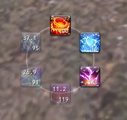

# wheel
gavlan wheel, gavlan deal

## usage
it's a one-button ninja wheel thing:
- `/wheel level ichi|ni|san` will set which level's cooldown is displayed
  (defaults to `Ni` on load)
- `/wheel alt ichi|ni|san` will set the spell level to be cast when right-clicked
  (defaults to `Ichi` on load)
- `/wheel spin [ichi|ni|san]` will cast the 12 o'clock spell at the given level
  (or what is configured by `/wheel level` if omitted)
- left-clicking an icon will cast that spell at the level set by `/wheel level`
- right-clicking an icon will cast that spell at the level set by `/wheel alt`
- `/wheel lock` will disable click-to-drag
- `/wheel unlock` will enable click-to-drag

sometimes the wheel gets jacked up and doesn't fully rotate. not sure what the
deal is, but you can just reload the addon to fix it.

## todo
- why's it not in `xitools` proper? because it breaks conventions and also i'm bad
- show all level recast timers (allow hiding unlearned?)
- fix the weird partial-turns
