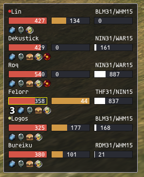
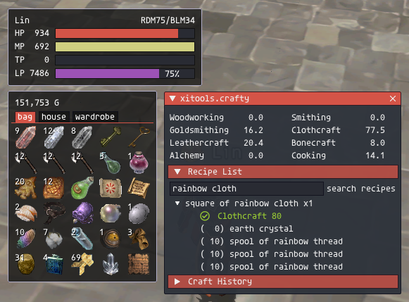
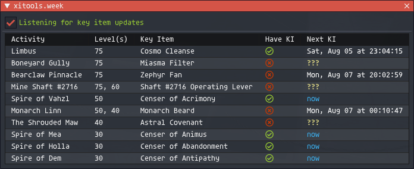

# xitools
a suite of UI replacement components.
- `me` displays information about the player
- `us` displays information about the party
- `pet` displays information about your pet
- `tgt` displays information about your target or subtarget
- `inv` shows your inventories with some interaction enabled
- `tracker` displays configurable timers for spells and abilities
- `treas` displays the current loot pool
- `week` tracks your ENMs because remembering things is hard
- `crafty` is a crafting skill tracker and recipe list
- `fishe` is a fishing skill tracker and hook monitor
- `log` is a dev tool that dumps packets to a log file, probably not useful

## usage
`/xitools` (or `/xit`) will bring up the config menu
`/xitools treas` (or `/xit t`) will open the `treas` window if it's enabled
`/xitools week` (or `/xit w`, `/xit enm`, `/xit e`) will open the `week` window if it's enabled
`/xitools crafty` (or `/xit c`) will open the `crafty` window if it's enabled
`/xitools fishe` (or `/xit f`) will open the `fishe` window if it's enabled
`/xitools inv` (or `/xit i`) will open the `inv` window if it's enabled

## todo
- [ ] `all`: hide ui when in cutscene
- [ ] `us`: make buff display a consistent line-height with `tgt`
- [ ] `us`: add a toggle to display buffs
- [ ] `us`: add a toggle to display the full size no matter what
- [ ] `us`: add a toggle to display distance instead of job
- [-] `us`: add a cast bar
- [ ] `tgt`: hide status information on friendly/non-applicable characters
- [-] `tgt`: show job-specific statuses (bard should see their own songs, for example)
- [ ] `tgt`: incorporate `mobDb`/`ibar` information
